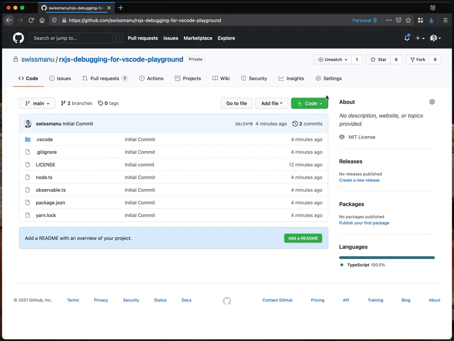

# 🤹‍♂️ Playground: RxJS Debugging for Visual Studio Code

> This repository contains a playground to explore the debugging capabilities of the [RxJS Debugging for Visual Studio Code](https://github.com/swissmanu/rxjs-debugging-for-vscode) extension.

## Usage

### Github Codespaces

You can use a [Github Codespace](https://github.com/features/codespaces) to explore the extensions functionality without any modification to your local development system as illustrated in the following:

- Open the repository in a Codespace.
- Install recommended extensions by confirming the regarding prompt.
- Enable some [operator log points](https://github.com/swissmanu/rxjs-debugging-for-vscode#operator-log-points) in `observable.ts`.
- Run the playground using the "Launch Program" launch configuration: This executes the playground with NodeJS.

### Local Setup

- Clone this repository.
- Install dependencies using `yarn` or `npm`, depending on your flavor.
- Open the cloned repository with Visual Studio Code.
- Code will automatically recommend to install the "RxJS Debugging for Visual Studio Code" extension: Confirm this prompt.
- Enable some [operator log points](https://github.com/swissmanu/rxjs-debugging-for-vscode#operator-log-points) in `observable.ts`.
- Run the playground using the "Launch Program" launch configuration: This executes the playground with NodeJS.

